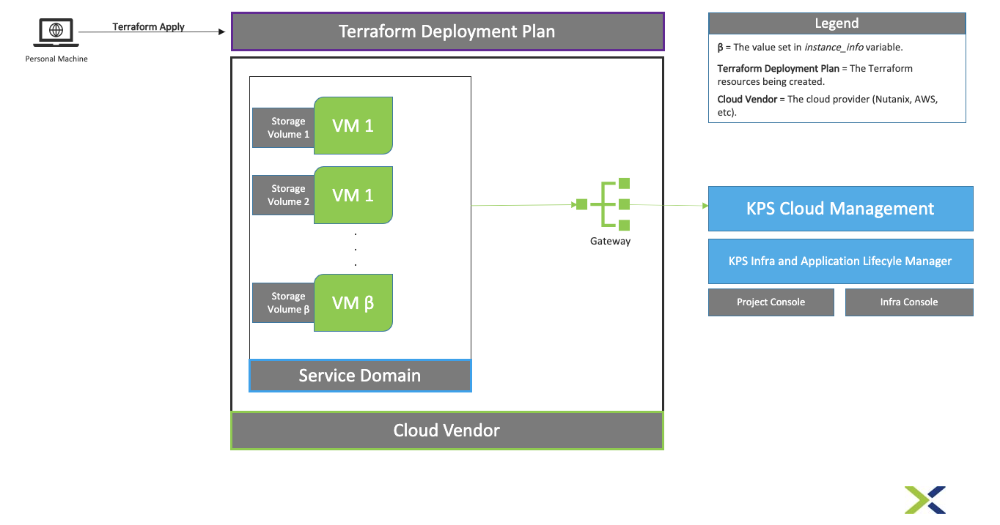

# Deploying a Service Domain with Karbon Platform Services

Enter the cloud provider directory of your choice. You will see a file called `variables.tf` where you can configure values such as provider info, cloud info, image config, etc.

### Nutanix Setup

You will need to download the Karbon Platform Services Service Domain qcow2 image from the [Nutanix Support Portal](https://portal.nutanix.com/page/downloads?product=karbonplatformservices) and add it to the 
workspace.

### Infrastructure Design

### Terraform Installation 

1. These scripts deploy a KPS service domain image onto different cloud providers as a VM and then onboard the created VM to your KPS account. This is performed in several steps such as image upload, VM creation, storage profile creation/attachment, and finally service domain onboarding.

2. These scripts require the following:
    * Terraform 0.12 or later
    * Cloud vendor command line interface
    	* Amazon Web Services
    		* [AWS CLI](https://aws.amazon.com/cli/)
    	* Microsoft Azure
    		* [Azure CLI](https://docs.microsoft.com/en-us/cli/azure/install-azure-cli)
    		* [AzCopy](https://docs.microsoft.com/en-us/azure/storage/common/storage-use-azcopy-v10)
    * Network access to provider
    * KPS cloud profile 

3. Configure the variables for the cloud provider of choice in `../<provider>/variables.tf`. The following tables provide descriptions of the variables that may require updating.

#### Nutanix Acropolis HyperVisor (AHV)
|Name | Required  | Description       |
|----------------|------------|--------------|
| `provider_info` | yes | Provider information for AHV cluster and authentication.  |
| `instance_info`     | yes  | The AHV instance information such as number of nodes and prefix.    |
| `nutanix_vm_config` | yes | The configuration of the VM being created on the AHV cluster. |
| `image_config` | yes | This variable is used to upload the KPS qcow2 file as an image configuration. This is where to specify the path to the downloaded qcow2. |
| `cloud_info` | yes | This variable will be used to configure the KPS cloud instance.  |
| `service_domain_info`   | yes  | The information for the KPS service domain name and virtual IP. |
| `node_info`  | yes  | This variable will be used to specify node subnet and gateway.    |
| `create_storage_profile` | yes | This variable is used to create a storage profile for the cluster. Using the default value is recommended. |
| `nutanix_volumes_config` | yes | The configuration of the Nutanix volume being created for the service domain. |
| `storage_profile_info` | yes | The information for the Nutanix volume such as name and type. Using the default value is recommended. The default type value is NutanixVolume with isDefault set to True. |

#### Amazon Web Services (AWS)
|Name | Required  | Description       |
|----------------|------------|--------------|
| `region` | yes | AWS region.  |
| `availability_zone` | yes | AWS availability zone.  |
| `profile` | yes | AWS profile.  |
| `environment` | no | The environment being worked in.  |
| `security_group` | yes | AWS security group being attached to EC2 instance.  |
| `amis` | yes | AWS ami being used for EC2 creation.  |
| `instance_info`     | yes  | The EC2 instance information such as number of nodes and prefix.    |
| `ec2_vm_config` | yes | The configuration of the VM being created on AWS EC2. |
| `cloud_info` | yes | This variable will be used to configure the KPS cloud instance.  |
| `service_domain_info`   | yes  | The information for the KPS service domain name and virtual IP. |
| `node_info`  | yes  | This variable will be used to specify the node subnet and gateway.    |
| `create_storage_profile` | yes | This variable is used to create an AWS storage profile. |
| `storage_profile_info` | yes | The information for the AWS storage profile such as name and type. Using the default value is recommended. The default type value is EBS with isDefault set to True. |
| `ebs_storage_config` | yes | The information for the EBS volume such as name and IOPS per Gib. |
| `data_partition_size_gb` | yes | The partition size of the EBS volume in Gib. |

### Cluster Deployment

#### Download Terraform Plugins
<pre>terraform init</pre>

#### Create Deployment Plan
<pre>terraform plan</pre>

#### Apply the Infrastructure Plan
<pre>terraform apply</pre>

#### Teardown Deployed Infrastructure
<pre>terraform destroy</pre>

## References

### Nutanix's Terraform Provider
https://www.youtube.com/watch?v=V8_Lu1mxV6g 

### Terraform Documentation
https://www.terraform.io/docs/providers/nutanix/index.html